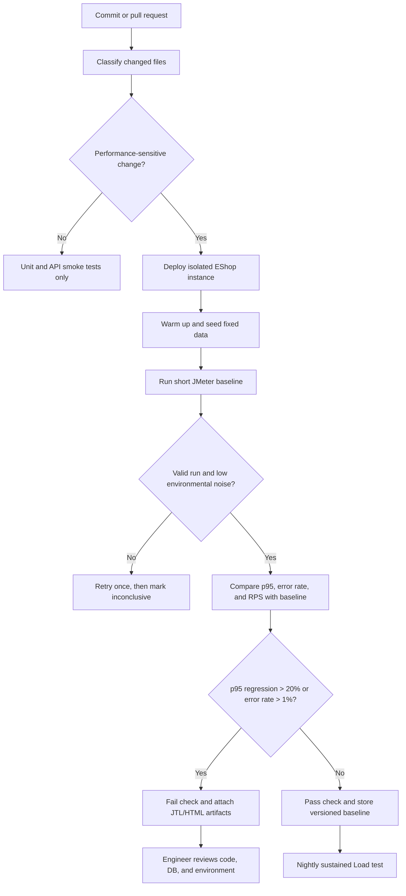

# Continuous Performance Testing Proposal

## Decision model

## Trigger policy

Run a short performance gate when a commit changes backend routes, database queries/schema, authentication, serialization, dependencies, or runtime configuration. Frontend-only documentation and styling changes receive only smoke tests. Run the full Load suite nightly, Stress weekly, and Soak before a release or after infrastructure/database changes.

## Regression rules

- Compare against the median of the last five valid runs on equivalent hardware, not a single run.
- Fail when p95 regresses by more than 20% and at least 50 ms, or error rate exceeds 1%.
- Warn when throughput falls by more than 15% at the same workload.
- Invalidate a run when CPU contention, insufficient warm-up, seed failure, or load-generator saturation is detected.
- Store raw JTL, HTML Dashboard, resource log, commit SHA, machine identity, and workload parameters.

## Trade-offs

Running every full suite on every commit is expensive and increases developer waiting time. Change-based selection lowers cost but can miss indirect regressions caused by shared libraries. Shared CI runners introduce noisy-neighbour effects and false alarms, while dedicated runners cost more. Percentage-only thresholds exaggerate tiny changes, so the model combines a relative and absolute p95 threshold. Automatically retrying once filters transient noise, but repeated retries can hide real intermittent failures; therefore a second failure blocks the change and an inconsistent pair is marked inconclusive for human review.

