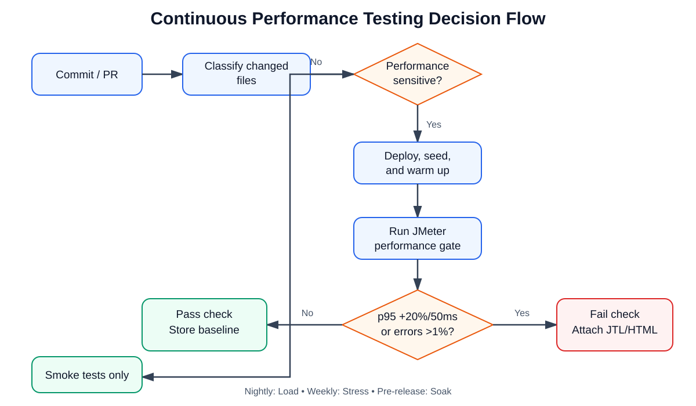

# HW05 - AI-Assisted Performance Testing

**Student ID:** 23127124  
**SUT:** EShop  
**Tool:** Apache JMeter 5.6.3  
**Test date:** 2026-09-03  
**Base URL:** `http://127.0.0.1:3000`

## 1. Executive summary

This assignment evaluates the EShop backend with one repeatable, data-driven business process under Load, Stress, Spike, and Soak conditions. The selected features are FR-01 Registration, FR-07 Shopping Cart, and FR-17 Coupon Management. Supporting login, product-read, coupon-application, and checkout requests are included to satisfy the required auth-heavy, read-heavy, and transactional endpoint groups.

The measured Load run sustained 120.94 HTTP RPS with zero failed samples and p95 of 23 ms. A first Stress level at 80 VUs reached 523.07 RPS with p95 of 20 ms. At 400 VUs, throughput rose only to 849.86 RPS while p95 increased to 636 ms, demonstrating a latency saturation region. The corrected 600-VU Spike reached 904.16 RPS with p95 of 914 ms, p99 of 1,146 ms, and 0.1658% errors. The ten-minute Soak sustained 926 RPS at 250 VUs with zero errors and p95 of 311 ms, establishing the measured endurance threshold for this local hardware configuration.

## 2. Environment and reproducibility

| Item | Configuration |
|---|---|
| Operating system | Windows 11 Home 10.0.26200 |
| Hostname | THOAI |
| CPU | AMD Ryzen 7 8845H, 16 logical processors |
| RAM | 13.81 GB |
| Backend | Node.js 24.18.0, Express 5.2.1, SQLite |
| Java | Eclipse Temurin 21.0.12.1 LTS |
| JMeter | 5.6.3 |
| Deployment | Backend and load generator on the same host |

Only the backend is started during measurement. This avoids frontend overhead and uses loopback networking to reduce unrelated network variance. The limitation is that JMeter and the SUT compete for the same CPU and RAM, so the results describe the endurance threshold of this complete local setup rather than an independently hosted production server.

`server.js` imports `database.js`, which recreates and seeds SQLite at backend startup. The backend is therefore restarted before each measured run. This also clears the process-local cart object.

## 3. AI-assisted design and human review

### 3.1 Workflow

1. Setup administrator login and creation of a unique coupon (FR-17).
2. Unique data-driven user registration (FR-01).
3. User login and JWT correlation.
4. Product list and detail reads.
5. Add product to cart and view cart (FR-07).
6. Apply the run coupon and complete checkout.
7. Teardown administrator login and deletion of the run coupon (FR-17).

The CSV contains 1,000 unique virtual-user identities and parameterized product/order data. Tokens, user IDs, coupon IDs, and order IDs are extracted from JSON responses.

### 3.2 Corrections made after executing AI output

- Replaced an unrealistic single-role interpretation with explicit administrator setup/teardown and a customer main group.
- Added product reads because the selected features alone did not meet the read-heavy requirement.
- Changed think-time from a Thread Group timer applied before every request to one pause per iteration.
- Increased CSV cardinality from 250 to 1,000 for the 600-VU Spike.
- Guarded the business flow so failed token extraction cannot cause cascading 403 errors.
- Preserved the rejected calibration results as audit evidence.

## 4. Test profiles

| Scenario | VUs | Ramp-up | Duration | Report view |
|---|---:|---:|---:|---|
| Load | 15 | 30 s | 180 s | Summary Report |
| Stress calibration | 80 | 120 s | 240 s | Aggregate Report |
| Stress saturation | 400 | 60 s | 180 s | Aggregate Report |
| Spike | 600 | 2 s | 90 s | Aggregate Graph |
| Soak | 250 | 60 s | 600 s | HTML Dashboard/raw JTL |

JMeter was executed in non-GUI mode. Raw JTL files are authoritative; Transaction Controller parent samples are excluded from HTTP request counts and throughput calculations.

## 5. Results

| Run | HTTP samples | Error rate | RPS | Average | p95 | p99 | Max | Max backend working set |
|---|---:|---:|---:|---:|---:|---:|---:|---:|
| Load 15 VU | 21,929 | 0% | 120.94 | 3.72 ms | 23 ms | 28 ms | 144 ms | 177.68 MB |
| Stress 80 VU | 126,316 | 0% | 523.07 | 5.50 ms | 20 ms | 38 ms | 290 ms | 183.77 MB |
| Stress 400 VU | 154,758 | 0% | 849.86 | 280.66 ms | 636 ms | 770 ms | 1,044 ms | 197.57 MB |
| Spike 600 VU | 83,242 | 0.1658% | 904.16 | 467.33 ms | 914 ms | 1,146 ms | 2,197 ms | 210.68 MB |
| Soak 250 VU | 557,131 | 0% | 926.00 | 146.90 ms | 311 ms | 396 ms | 2,466 ms | 211.34 MB |

### 5.1 Load

The Load run passed the proposed p95 < 1,000 ms and error-rate < 1% criteria by a wide margin. It establishes a low-contention baseline rather than the maximum system capacity.

### 5.2 Stress

Increasing concurrency from 80 to 400 VUs (5x) increased throughput only from 523.07 to 849.86 RPS (1.62x), while p95 rose from 20 to 636 ms. This flattening of throughput combined with a sharp latency rise indicates saturation even without HTTP errors.

### 5.3 Spike

The corrected Spike run recorded 69 refused registration connections, 67 refused login connections, and two 401 login responses. The 0.1658% error rate remained below 1%, but p99 exceeded the one-second target. The service degraded under the abrupt load but completed the run without a process crash.

### 5.4 Endurance threshold

The 250-VU Soak sustained 926.00 RPS for ten minutes with 557,131 HTTP samples, zero errors, average latency 146.90 ms, p95 311 ms, and p99 396 ms. The maximum observed backend working set was 211.34 MB. This is the maximum stable sustained rate actually demonstrated on this hardware; it is not a universal capacity claim.

Memory did not form a clear flat plateau. Average working set was 192.74 MB in minute 5, 194.76 MB in minute 6, 197.89 MB in minute 7, 205.91 MB in minute 8, and 207.07 MB in minute 9. Source review confirms that checkout never clears the process-local cart and every cart POST appends another object. The result therefore supports an application-level unbounded-retention issue. Longer observation would be required to separate the retained-cart growth rate from Node.js garbage-collection and growing cart-response overhead.

## 6. AI analysis and misinterpretation hunt

The preserved AI analysis and human review are included under `analysis/`. The main corrections are that a short Stress run cannot prove an endurance threshold, a low aggregate Spike error rate does not erase connection refusals and p99 regression, and short-run memory growth does not by itself prove a leak. Recommendations were checked against the actual Node.js/SQLite implementation.

## 7. Genuine issues

Two issue drafts are included:

1. Connection refusals and p99 regression during a corrected 600-VU Spike.
2. Checkout does not clear the process-local cart, creating functional and sustained-memory risk.

The student must attach screenshots and publish the verified issues to the public GitHub repository.

## 8. Continuous Performance Testing proposal

The proposed pipeline classifies changed files and runs a performance gate for backend routes, database changes, authentication, serialization, dependencies, or runtime configuration. It compares p95/error rate/RPS with the median of five valid runs on equivalent hardware. A regression fails when p95 increases by more than both 20% and 50 ms, or when error rate exceeds 1%. Full Load runs execute nightly, Stress weekly, and Soak before releases.

The full flowchart and trade-off analysis are in `docs/continuous-performance-testing.md`.

## 9. AI critique

The AI was useful for quickly converting the assignment into an executable JMeter design, but its first outputs were incomplete in three important ways. First, it treated FR-01, FR-07, and FR-17 as a natural single-user journey, even though coupon management is an administrator operation and the selected features do not provide a suitable read-heavy flow. Human review corrected this by separating coupon setup and teardown from the customer workflow and adding product reads. Second, the generated JMeter plan placed a random timer at Thread Group scope. JMeter therefore applied the delay before every sampler instead of once per business iteration, reducing a ten-second smoke run from 142 to only 26 samples. Third, the initial CSV contained 250 identities while the Spike test used 600 virtual users. Recycled identities caused duplicate registrations, and failed authentication produced thousands of misleading 403 responses. The corrected plan uses 1,000 rows and prevents the business flow from running without a successfully extracted token. The AI also overinterpreted short-run memory growth as proof of a leak and suggested a conventional database connection pool even though the SUT uses embedded SQLite. These failures occurred because the model reasoned from generic performance-testing patterns without executing JMeter scope semantics, checking data cardinality against peak concurrency, or validating the actual database architecture. The main lesson is that AI output should be treated as a testable hypothesis. Collaboration is reliable only when every design decision is exercised with a small run, raw logs are preserved, derived metrics are independently recalculated, and recommendations are checked against the implementation before acceptance.

## 10. Optimization assessment

| Recommendation | Decision | Reason |
|---|---|---|
| Enable SQLite WAL | Feasible; benchmark first | It can improve read/write concurrency but does not remove every serialized write limit. |
| Move carts to Redis | Feasible | It removes process-local retention and enables multi-process deployment, at added operational cost. |
| Cache product lists | Feasible with invalidation | The endpoint is read-heavy; product CRUD must invalidate cached values. |
| Ordinary product-name index | Unsupported | The current `LIKE '%keyword%'` query has a leading wildcard and generally cannot use a normal B-tree efficiently. |
| Database connection pool | Hallucinated for this architecture | SQLite is embedded rather than a network database that benefits from conventional connection pooling. |
| Enable Node.js cluster immediately | Unsafe as stated | Process-local carts must be externalized or consistently routed first. |

## 11. Conclusion

The measured local SUT scales efficiently at low concurrency but enters a latency-saturation region before 400 VUs. At 600 abruptly started VUs, throughput rises modestly while p99 passes one second and the listener observes connection refusals. The demonstrated endurance threshold is 926 RPS at 250 VUs for ten minutes, with p95 311 ms, 0% errors, and a 211.34 MB observed memory ceiling. The upward memory trend and cart implementation justify a verified functional/performance issue, not an unsupported generic memory-leak claim.

## 12. Evidence still requiring the student

- Task Manager/JMeter screenshots from each scenario in the same frame.
- `dxdiag` screenshot showing hostname THOAI.
- At least six minutes of Vietnamese narration in an unlisted YouTube video.
- Published GitHub Issue links and screenshots.
- Public repository URL and demo video URL.
- Student approval of the human-review conclusions and self-assessed grade.

## Appendix A - AI Audit declaration

I use AI tools for the following tasks. The interaction log records the AI tool, date/time, student prompt, output, corrections, and generated artifacts. The full audit is supplied separately in Markdown and PDF. Calibration failures are retained rather than hidden because they demonstrate the required human review.
